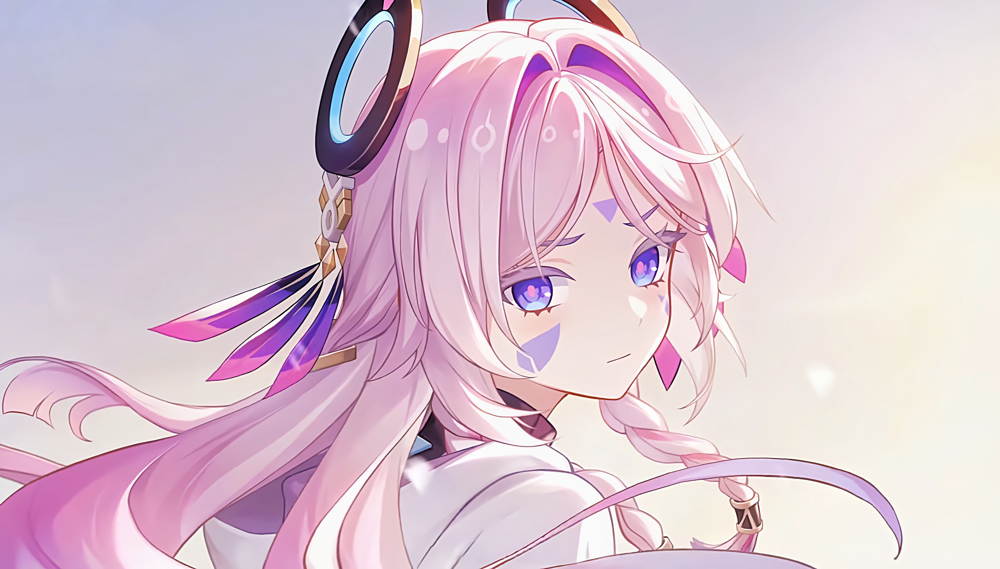

> Citlali, the _star_, turned back and casted a glance at her past, because she knew that she will never be alone since the Traveller came to her side.

# Introduction 🦀🌸🌟

A chronically sleep-deprived undergraduated student~ I am either sleeping or sinking into sleep~

## My Hobbies...

- Learn knowledge about computer science, including but not limited to...
  - programming language
  - compilation theories
  - operating system
- Play games...
  - Minecraft
  - Genshin Impact
  - Honkai: Star Rail (I think I will probably drop it when I am exhausted in affording it...)
  - ~~Zenless Zone Zero~~ (It is a pity that I'll probably no longer logging in this game for a long time because I am a little tired...)

## My Abilities...

- Program with **Rust** (MAJOR), C# and C++ (less skilled than the former ones)
- Develop a simple Unity game

## I'm the main of...

- **Citlali** (MAJOR), Ayaka and Furina in _Genshin Imapct_.
  - PS: I ship "Aether × Citlali", because there is nothing sweeter than "grandpa" accompanying "grandma"! ;)
- **Ruan Mei** in _Honkai Star Rail_.
- **Miyabi** in _Zenless Zone Zero_.
