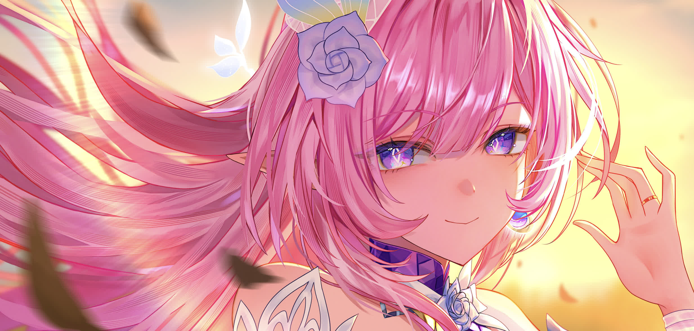

  <figure>
    
    <figcaption>
      <em>"This will be a romantic story like none that has come before. You think so too, right?"</em>
    </figcaption>
  </figure>

# Self-Introduction

  
  
  
  
  
  
  
  
  
  
  
  

---

Hi, I'm InfyniteHeap, a Bachelor of Engineering graduate and have a passion for
programming and computer science.

- **Tech Stack**:
  - **Language**: Rust, C#, Python, Zig, C++
  - **Operating System**: Linux[^1] (NixOS), Windows 11
  - **IDE/Editor**: Visual Studio, Visual Studio Code, Neovim
  - **Game Engine**: Unity

I'm a big fan of **Rust** because of its **memory safety** guarantees and the
incredibly **ergonomic** toolchain (Cargo is life!).

Besides above, when I'm not fighting the annoying compiler error messages, you
can find me in Teyvat, boarding the Astral Express, or building redstone
machines in Minecraft.

  
  

[^1]: Formally, "Linux" only refers to the Linux kernel.
